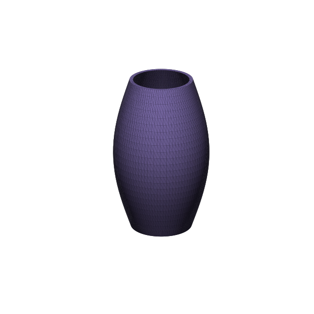

# 3D Studio — natural language → print-ready 3D

A **Claude Code plugin** + **agent harness** that turns a natural-language
description (and optional reference images) into **print-ready 3D files**
(STL · 3MF · GLB) you can drop straight into Bambu Studio, OrcaSlicer, PrusaSlicer,
or MakerWorld — validated against the 2026 *AI 3D Print-Readiness Benchmark*, with a
React + three.js preview UI.

> **The agent does the modeling.** The primary engine is a local, *manifold-by-
> construction* CSG kernel that the agent writes geometry against — deterministic,
> free, needs no GPU or API key, and produces watertight solids by construction
> (~100% slicer pass). An optional generative backend (Meshy / local models) handles
> genuinely organic shapes, always followed by validate → repair.



---

## Why this design

There are two ways to make 3D with AI:

| Path | Best for | Watertight? | Needs |
|---|---|---|---|
| **Local CSG** (this project's default) | mechanical / functional parts — brackets, enclosures, holders, knobs, gears, fixtures, signs | **~100% by construction** | nothing — pure Python |
| **Generative neural** (Meshy / Hunyuan3D / TRELLIS) | organic shapes — figurines, characters, animals | ~55% out-of-box, ~97% slicer-pass | API key or GPU |

The local CSG path is the headline feature: the agent reasons about geometry and
**writes a small script** in a curated DSL; the harness executes it in a sandbox and
the `manifold3d` boolean kernel guarantees a watertight, 2-manifold solid. Generative
output is great for shapes you can't express parametrically, but **no** generative
model is print-ready by default — so every generated mesh is forced through the same
validation/repair gate.

## Architecture

```
 natural language + images
            │
            ▼
   ┌───────────────────┐     spec-analyst (subagent)
   │     ModelSpec      │◀──  category · dims(mm) · profile · engine
   └───────────────────┘
            │  engine router (auto)
   ┌────────┴─────────────────────────────┐
   ▼ csg (default)                          ▼ generative (organic)
 cad-author writes DSL script        Meshy API (test-key/mock fallback)
   │                                         │ → GLB
 sandbox (isolated subprocess,              │
   restricted builtins, rlimits,            │
   timeout) → trimesh + manifold3d          │
   └──────────────┬──────────────────────────┘
                  ▼
        validate()  ── Meshy 4-Dimension Benchmark ──
        D1 mesh integrity · D2 slicer pass · D3 print geometry · D4 workflow
        (watertight/manifold, wall thickness via ray cast, overhangs, bed fit)
                  │
                  ▼  repair if needed (merge, fix normals, fill holes)
        exporters → output/<slug>-NNN/
            model.stl · model.3mf(mm+color) · model.glb · thumb.png
            report.json · spec.json · provenance.json
                  │
                  ▼
        output/manifest.json  →  web/ (React + three.js static viewer)
```

## Components

```
.claude-plugin/plugin.json     plugin manifest (+ marketplace.json)
skills/                        NATIVE entry points (always-on, user-invocable):
  model3d/                     interactive design-session orchestration + fidelity loop
  grill-me/                    interactive Q&A → validated design plan
mcp/server.py + .mcp.json      3d-studio-registry MCP server — serves the registry ON DEMAND
                               (~0 always-on cost): list_skills/load_skill, list_agents/
                               load_agent, studio3d_reference/styles/subjects
registry/skills/               on-demand reference knowledge:
  print-readiness/ cad-authoring/ printer-setup/ 3d-modeling-foundations/
registry/agents/               on-demand specialists:
  spec-analyst.md cad-author.md mesh-validator.md design-critic.md
bin/studio3d                   CLI wrapper (resolves the plugin-data venv)
hooks/                         SessionStart venv bootstrap
harness/studio3d/              the Python harness
  dsl/                         manifold CSG DSL (+ twist/ellipsoid/loft/load_mesh)
  sandbox.py                   safe execution of authored scripts
  validate.py                  print-readiness validator (D1–D4)
  render.py · _blender_render.py   multi-view renders (visual-critique loop)
  profiles.py · data/printers.json  printer DB + user profiles (XDG, YAML)
  history.py                   git-tracked design history (isolated store)
  exporters.py                 STL / 3MF / GLB / thumbnail / manifest
  generative.py                Meshy backend + mock fallback
  spec.py · cli.py
examples/                      print-safe DSL example parts (owl, twist-vase, …)
web/                           React 19 + Vite + three.js viewer (Z-up, live polling)
tests/                         pytest end-to-end suite (48 tests)
output/                        generated bundles (one evolving folder per design)
```

## Install (as a Claude Code plugin)

```bash
# add the marketplace, then install the 3d-studio plugin
claude plugin marketplace add kryptobaseddev/3d-ai-studio
claude plugin install 3d-studio@studio3d-tools
```

Or with the in-session slash commands:

```
/plugin marketplace add kryptobaseddev/3d-ai-studio
/plugin install 3d-studio@studio3d-tools
```

For development / local use, clone and point Claude Code at the directory:

```bash
git clone https://github.com/kryptobaseddev/3d-ai-studio
claude --plugin-dir 3d-ai-studio
```

**Requirements:** Python 3 (the SessionStart bootstrap hook auto-provisions the
harness venv with its deps — falls back to a local `.venv` in dev). Blender is
**optional** (renders fall back to matplotlib). Node is only needed for the web
viewer. Verify with `studio3d doctor`.

## Use it

Just ask, in natural language:

> "Model a wall bracket with two screw holes, 70mm wide."
> "Design a hexagonal pen holder, 90mm tall."
> "Make me a printable cable clip for two cables."

The `/model3d` skill orchestrates spec-analyst → cad-author → validate → export, then
reports the print-readiness score and the output bundle.

### CLI directly

```bash
# from a DSL script
studio3d gen-script --script part.py --name my-part --out output

# multi-view render for the visual-critique loop (Blender; matplotlib fallback)
studio3d render output/my-part/model.stl

# printer profiles (XDG config; drives bed-fit, wall mins, AMS color)
studio3d printers --search "bambu a1"
studio3d profile add --name my-a1 --printer "Bambu Lab A1" --ams true \
  --colors "#1a1a1a,#f5f5f5,#e23b3b,#2b6cd4"
studio3d profile use my-a1

# import an existing STL/3MF/GLB to modify, then edit it with load_mesh(...)
studio3d import ~/Downloads/box.stl --name box --reorient

# git-tracked change history (point-in-time recovery; one evolving bundle)
studio3d history --bundle my-part
studio3d history --bundle my-part --revert <sha>

studio3d validate model.stl    # print-readiness report (D1–D4)
studio3d doctor                # env + blender + active profile
studio3d examples              # list bundled example scripts
```

### Design sessions, styles & reference library (v3)

Generation is grounded so models actually look like the subject and carry a chosen
**artistic style** (clean / realistic / cartoonish / chibi / anime / low-poly / geometric):

```bash
studio3d styles                       # the 7 styles + their geometry params
studio3d reference owl --style cartoonish   # grounded BRIEF: silhouette cues + head-unit-H
                                            # proportions + CSG recipe (20 subjects packaged)
studio3d plan new --subject owl --style cartoonish --height 88 --out owl.design.json
studio3d gen-script --script owl.py --plan owl.design.json --out output   # fabricate from the plan
```

- **Reference library** (`data/reference_library.json`, 20 subjects) gives the agent the
  essential silhouette cues + numeric proportions, so it **authors by proportion** (a
  head-unit `H`) instead of guessing — this is what makes the owl read as an owl.
- **Style system** (`data/styles.json`) carries concrete params (head:body ratio, eye-size
  multiplier, facet level…) per style.
- **Design plan** (`design.json`) is the regenerable **base design** produced by the
  **`/grill-me`** interactive session (text + reference images → a validated spec of subject,
  style, dimensions, wall thickness, colors, characteristics, parts). Tweak a field and
  regenerate; the plan is persisted into each bundle and tracked in history.
- **Vision-grounded critique**: the `design-critic` renders the model and scores it against
  the reference cues, the style params, **and any user-supplied 2D reference images**.

### The fidelity loop (99% intent-match)

Generation is not one-shot. The agent **generates → renders → looks → critiques →
revises** until the model both matches the request and is print-ready:

1. `studio3d gen-script …` builds + validates.
2. `studio3d render …` produces front/right/top/iso PNGs (Blender Workbench).
3. The agent (or the `design-critic` subagent) **reads the renders** and scores intent
   on a 5-criterion rubric (feature presence, proportion, function, silhouette,
   print-readiness).
4. It revises the script and regenerates with the **same name** (overwrite in place —
   git history captures the change) until intent-match ≥ ~95 and `print_ready` is true,
   bounded to ≤4 passes (best-so-far kept). *A model that validates can still miss the
   intent — so it always looks before shipping.*

### Printer profiles (XDG, cross-platform)

`studio3d profile` manages YAML profiles in the OS config dir (`~/.config/studio3d/`
on Linux, `~/Library/Application Support/studio3d/` on macOS, `%APPDATA%\studio3d\` on
Windows). Each profile is a real printer (make/model + AMS + filament colors) backed by
an in-repo database of **29 machines** (Bambu A1/P1/X1/H2D, Prusa MK4S/CORE One/XL,
Creality K-series/Ender V3, Elegoo, Anycubic, Formlabs) with exact build volumes,
nozzles, AMS color capacity, and slicer quality presets. The active profile targets
generation to that printer.

### Live preview

`cd web && npm run dev` serves the viewer at http://localhost:5173; it **polls the
output folder** and a dev middleware serves models directly, so regenerating a design
updates the 3D view live during a session — no rebuild, no copy step.

## Preview in the browser

```bash
cd web
npm install
npm run sync     # copy output/ bundles into the app
npm run dev      # http://localhost:5173   (or: npm run build && npm run preview)
```

The viewer is a static React + three.js app (`@react-three/fiber` + `drei`): a model
gallery, an auto-fit 3D view on a print-bed grid, downloadable STL/3MF/GLB, and a live
print-readiness report (D1/D3) driven entirely by `output/manifest.json` — no backend.

## Print-readiness (the 4-dimension benchmark)

Every model is scored 0–100 across four independent dimensions (see the
`print-readiness` skill for the full rule set + citations):

- **D1 Mesh Integrity** — watertight, 2-manifold, outward normals (hard gate).
- **D2 Slicer Pass** — opens cleanly and slices to valid G-code.
- **D3 Print Geometry** — min wall (≥0.8mm FDM 0.4 nozzle), overhangs (≤45–50°),
  bed fit, feature sizes — wall thickness measured by inward ray casting.
- **D4 Workflow** — mm units, 3MF for color/Bambu AMS vs STL for legacy.

## Generative backend (optional)

```bash
export MESHY_API_KEY=msy_...      # or leave unset → deterministic mock
export STUDIO3D_GEN_BACKEND=meshy # meshy | mock | auto
```
With no key, the harness uses a deterministic mock so the whole pipeline (and UI)
runs offline. The Meshy path implements the documented async create→poll→download
loop and ships with the public test key for credential-free integration testing.

## Tests

```bash
PYTHONPATH=harness ./.venv/bin/python -m pytest tests -q   # 48 tests
```
Covers the DSL primitives, CSG manifold guarantees, sandbox security/timeout,
the validator (D1–D4), exporters + 3MF round-trip, and every bundled example
fabricated end-to-end.

## Provenance

The architecture was derived from a 6-track deep-research pass (generative backends,
parametric CAD, mesh validation, plugin architecture, web UI, and print-domain best
practices) grounded in the Meshy 2026 benchmark, Bambu Lab, Prusa, Protolabs, and
Formlabs design guides. Verified stack on **CPython 3.14**: trimesh 4.12 · manifold3d ·
numpy 2.4 · scipy 1.17 · shapely 2.1 · rtree · matplotlib (headless thumbnails).

## License
MIT.
